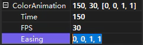
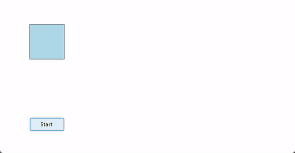

# TransiMate

实现 WinForms 过渡动画的最佳方案

## 安装
- ```
  Install-Package KlxPiaoControls
  ```
- 前往 [release](https://github.com/miniyu157/TransiMate/releases) 下载最新版的 ```TransiMate.dll``` 并添加依赖项
- 克隆此仓库，将项目添加到解决方案中

## 使用
- 创建 ```AnimationInfo``` 结构体
  
  ```
  new AnimationInfo(int time, int fps, string controlPoint)
  new AnimationInfo(int time, int fps, EasingType easingType)
  ```

- 方法 ```TransiMateTick.Start``` 重载
  
  ```
  Start<T>(T startValue,
      T endValue,
      AnimationInfo animationInfo,
      Action<T> setValue,
      CancellationToken token = default) where T : notnull
  
  Start<T>(T startValue,
      T endValue, int time,
      int fps,
      CustomEasingDelegate customEasing,
      Action<T> setValue,
      CancellationToken token = default) where T : notnull
  ```

## 注意

- TransiMateTick.Start 方法中的 ```startValue``` ```endValue``` ```setValue``` 类型必须相同<br>
  否则编译器会提示错误
- TransiMateTick.Start 方法使用了 ```TypeInterpolator``` 类中的方法进行插值运算<br>
  默认支持的类型有 ```int``` ```float``` ```double``` ```Color``` ```Size(F)``` ```Point(F)```

  若想手动实现指定类型的差值器，可以参考以下注册 ```Rectangle``` 差值器的示例
  ```
  public class RectangleInterpolator : IInterpolatorStrategy
  {
      public object Interpolate(object startValue, object endValue, double progress)
      {
          Rectangle start = (Rectangle)startValue;
          Rectangle end = (Rectangle)endValue;
          int newX = start.X + (int)((end.X - start.X) * progress);
          int newY = start.Y + (int)((end.Y - start.Y) * progress);
          int newWidth = start.Width + (int)((end.Width - start.Width) * progress);
          int newHeight = start.Height + (int)((end.Height - start.Height) * progress);
          return new Rectangle(newX, newY, newWidth, newHeight);
      }
  }
  ```
  ```
  TypeInterpolator.RegisterStrategy<Rectangle>(new RectangleInterpolator());
  ```

- ```AnimationInfoConverter``` 类使结构体 ```Animation``` 可以在属性窗口中展开编辑
  
  

  用户可以直接输入 ```EasingType``` 枚举中的成员，例如输入 EaseInOut 后会被自动解析为 (0.42, 0, 0.58, 1)

## 示例

以下是一个简单的示例，代码中包含不同的运作方式



- 首先引入命名空间

  ```
  using TransiMate;
  ```

- 然后添加以下代码

  ```
  public partial class Form1 : Form
  {
      public Form1()
      {
          InitializeComponent();
            
          button1.Click += Button1_Click;
      }
  
      bool to = false;
      CancellationTokenSource cts = new();
  
      private void Button1_Click(object? sender, EventArgs e)
      {
          to = !to;
  
          cts.Cancel();
          cts = new();
  
          // Position transition
          _ = TransiMateTick.Start(
              panel1.Left,                                            // start value
              to == true ? 442 : 67,                                  // end value
              new AnimationInfo(500, 120, EasingType.EaseInOutCubic), // animation info (use preset)
              value => panel1.Left = value,                           // set value
              cts.Token);                                             // cancel token
  
          // Color transition
          _ = TransiMateTick.Start(
              panel1.BackColor,                                       // start value
              to == true ? Color.LightGreen : Color.LightBlue,        // end value
              new AnimationInfo(500, 30, "0, 0, 1, 1"),               // animation info (use specified Bezier control points)
              value => panel1.BackColor = value,                      // set value
              cts.Token);                                             // cancel token
  
          // Size transition with custom easing function
          _ = TransiMateTick.Start(
              panel1.Size,                                            // start value
              to == true ? new Size(150, 150) : new Size(80, 80),     // end value
              500,                                                    // duration (ms)
              120,                                                    // delay (ms)
              p => EaseInOutCubic(p),                                 // custom easing function
              value => panel1.Size = value,                           // set value
              cts.Token);                                             // cancel token
      }

      // Custom easing function
      static double EaseInOutCubic(double progress)
      {
          if (progress < 0.5)
          {
              return 4 * progress * progress * progress;
          }
          else
          {
              double f = ((2 * progress) - 2);
              return 0.5 * f * f * f + 1;
          }
      }
  }
  ```

## 贡献

欢迎提出问题、建议或创建 Pull request 以改进此项目。

## 许可证

此项目基于 MIT 许可证，详情请参阅 [LICENSE](/LICENSE.txt) 文件。